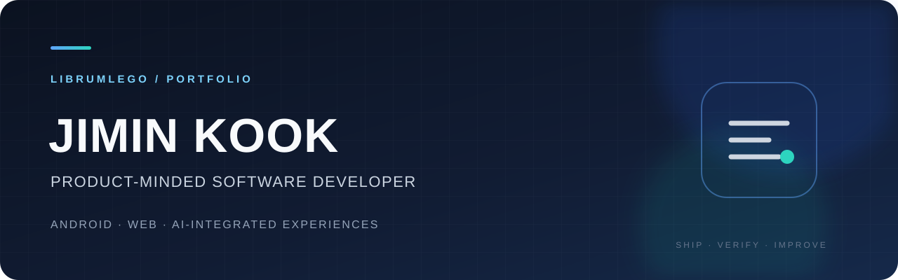

<h3>아이디어를, 직접 써볼 수 있는 경험으로.</h3>

안녕하세요, 국지민입니다. Android 앱과 웹 인터랙션을 만들고, AI와 외부 API를 사용자 흐름에 연결합니다.

<a href="https://app.notion.com/p/3b7694a294028144a9a1de534fa21cb3"><strong>Notion Portfolio ↗</strong></a> · <a href="https://librumlego.github.io/bullet-reclaimer/">Play a project ↗</a>

## Selected work

<table>
<tr><td width="30%"><strong>🍳 <a href="https://github.com/LibrumLego/Toma">TOMA</a></strong> AI KITCHEN ASSISTANT</td><td>텍스트·음성·사진·링크를 레시피와 조리 흐름으로 연결하는 Android 앱.  <code>Kotlin · Jetpack Compose · Room · OpenAI API</code>  <a href="https://app.notion.com/p/3b7694a2940281ebba01d45143ddacb9">프로젝트 스토리 ↗</a></td></tr>
<tr><td width="30%"><strong>🎮 <a href="https://github.com/LibrumLego/bullet-reclaimer">Bullet Reclaimer</a></strong> ONE BULLET. EVERY DECISION.</td><td>시간을 멈춰 도탄을 설계하고, 단 한 발의 탄환을 직접 회수하는 웹 액션 게임.  <code>TypeScript · Phaser 3 · Vite · GitHub Pages</code>  <a href="https://app.notion.com/p/3b7694a29402810e9b12d686ce72df94">프로젝트 스토리 ↗</a> · <a href="https://librumlego.github.io/bullet-reclaimer/">Live demo ↗</a></td></tr>
<tr><td width="30%"><strong>〰️ <a href="https://github.com/LibrumLego/tremor-station">Tremor Station</a></strong> MOTION INTO INTERACTION</td><td>센서 입력을 파형·게이지·결과·기록으로 보여 주는 앱인토스 미니앱.  <code>React · TypeScript · Vite · Apps in Toss · Canvas</code>  <a href="https://app.notion.com/p/3d5694a294028174b4f9f218e078022c">프로젝트 스토리 ↗</a></td></tr>
<tr><td width="30%"><strong>📰 <a href="https://github.com/LibrumLego/ai-news-summarizer">AI News Insight</a></strong> FROM URL TO INSIGHT</td><td>뉴스 URL을 입력하고 요약 결과를 확인하는 Next.js 웹 인터페이스.  <code>Next.js · React · TypeScript · Tailwind CSS</code>  <a href="https://app.notion.com/p/3b7694a2940281c7975ad44bd56bf22f">프로젝트 스토리 ↗</a></td></tr>
<tr><td width="30%"><strong>📱 <a href="https://github.com/LibrumLego/Clicker">Clicker</a></strong> SMALL UTILITY. CLEAR INTERACTION.</td><td>여러 카운터의 이름·색상·증가량을 설정하고 빠르게 조작하는 Android 유틸리티.  <code>Kotlin · Android · ViewModel · SharedPreferences · AdMob</code>  <a href="https://app.notion.com/p/3b7694a294028133a6cad7028df677ef">프로젝트 스토리 ↗</a></td></tr>
</table>

## Competition experience

| 대회 / 프로젝트 | 참여 내용 | 진행·결과 |
| :--- | :--- | :--- |
| 2026 관광데이터 활용 공모전 · 원곡 보더리스 | 원곡동 다문화거리의 지도 검색, 다국어 안내, AI 추천, 도보 코스와 GPS 스탬프를 연결하는 웹 서비스 | 진행 중 |
| NAN 2026 · [Bullet Reclaimer](https://github.com/LibrumLego/bullet-reclaimer) | AI 도구를 활용한 웹 액션 게임 제작, 게임 규칙 구체화와 동작 검증 | 참가 완료 · 본선 미진출 |
| NYPC Master Qualification Round · AnsanDreas | LLM을 활용한 전략 봇 개선 과정에서 패배 로그 분석, 이전 버전과의 반복 대전 및 결과 비교 | 예선 참가 완료 · 본선 미진출 |

### NYPC Master · 로그에서 실패 원인을 찾고 비교 대전으로 검증하기

AnsanDreas 팀으로 참가해 LLM을 활용한 전략 봇의 개선과 검증에 참여했습니다. 패배 리플레이를 턴별로 재구성하고 병력 수, 초반 방어, 자원 사용과 행동 조건을 비교했습니다.

- **로그 분석:** 패배 9판에서 병력 부족이 반복되는 것을 확인하고, 골드가 남아도 훈련 상한이나 실행 조건 때문에 병력을 확보하지 못하는 상황을 살폈습니다.
- **버전 비교:** 82126과 84723의 직접 대전에서 82126이 27:9로 우세한 결과를 확인했습니다. 새 버전이라는 이유만으로 채택하지 않고 기존 버전과 비교해 판단했습니다. 이 수치는 내부 비교 결과이며 공식 대회 성적이 아닙니다.
- **평가의 한계:** 방어형 봇끼리 반복 대전하면 무승부가 많아지고 내부 비교만으로는 전략의 범용성을 판단하기 어렵다는 점을 확인했습니다.
- **배운 점:** AI가 제안한 로직을 곧바로 개선으로 간주하지 않고, 실제 실행과 로그를 확인하며 회귀 여부를 검증해야 한다는 기준을 얻었습니다.

코드 작성과 분석에는 LLM을 활용했습니다. 위 내용은 팀 리플레이 중 제 이름으로 기록된 분석과 비교 경험을 정리한 것이며, 팀원 개인의 구현 성과와 구분했습니다.

## How I build

| 01 · 사용자 흐름 | 02 · 상태와 데이터 | 03 · 확인 가능한 결과 |
| :--- | :--- | :--- |
| 입력부터 결과·재방문까지 화면 흐름을 나눕니다. | 로딩·실패·권한과 외부 API 응답을 함께 다룹니다. | 코드, 실행 방법, 데모와 프로젝트 설명을 연결합니다. |

## Toolkit

**Android** — Kotlin · Jetpack Compose · ViewModel · Room  
**Web** — TypeScript · React · Next.js · Vite  
**Integrations** — OpenAI API · Apps in Toss · Firebase · AWS Lambda 연동

More projects

- [일단보류 · Hold First](https://github.com/LibrumLego/hold-first) — 소비 기록·숙려·재결정 흐름을 다루는 미니앱
- [원곡 보더리스](https://github.com/LibrumLego/wongok-borderless) — 음식·문화·도보 코스를 연결하는 관광 서비스

공개 여부와 열람 권한에 따라 위 저장소 접근이 제한될 수 있습니다.

---

Jimin Kook · LibrumLego / Android · Web · AI
