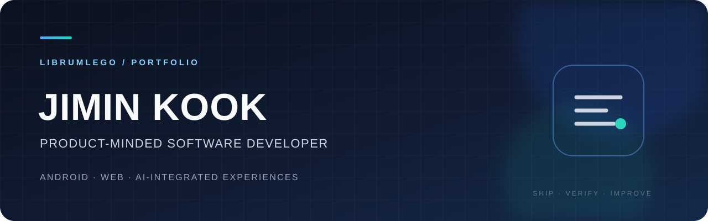

  FRONTEND · WEB · AI-INTEGRATED PRODUCTS
  <h2>데이터와 상태를 정리해, 끝까지 동작하는 제품을 만듭니다.</h2>
  
React·TypeScript 웹 서비스와 Kotlin 앱을 기획·구현하고 출시한 신입 개발자입니다. 외부 API와 상태·저장을 실제 사용자 흐름에 연결합니다.

  

    <a href="https://github.com/LibrumLego/hold-first-portfolio"><strong>일단보류 · 출시 서비스</strong></a>
    &nbsp;·&nbsp;
    <a href="https://wongok-borderless.vercel.app"><strong>원곡 보더리스 · Live</strong></a>
    &nbsp;·&nbsp;
    <a href="https://chip-crown-ae1.notion.site/Frontend-Web-Portfolio-3eb694a29402815999c4f28e405c4e58"><strong>Notion Portfolio</strong></a>
  

---

## What I bring

| 데이터 구조 | 안정적인 상태 흐름 | 완성하고 배포하는 힘 |
| :--- | :--- | :--- |
| 서로 다른 입력을 공통 모델로 정리해 화면·저장·후속 기능에서 재사용합니다. | 로딩, 실패, 권한, 늦은 응답과 실행 환경 차이를 정상 흐름과 함께 설계합니다. | 팀 기능 통합부터 플랫폼 검증, 문서화와 배포까지 결과물로 마무리합니다. |

  <kbd>4인 팀장</kbd>&nbsp;&nbsp;
  <kbd>8개 공통 데이터 필드</kbd>&nbsp;&nbsp;
  <kbd>캡스톤 A0</kbd>&nbsp;&nbsp;
  <kbd>앱인토스 출시</kbd>&nbsp;&nbsp;
  <kbd>GitHub Pages 자동 배포</kbd>

## Featured projects

웹·프론트엔드 지원에서는 **일단보류 → 원곡 보더리스 → TOMA** 순서로 확인해 주세요.
서비스 출시, 화면·API·저장 연동, 팀 기능 통합을 각각 보여주는 프로젝트입니다.

| 프로젝트 | 내 역할과 구현 경험 | 확인할 자료 |
| :--- | :--- | :--- |
| **일단보류 · Hold First** | 개인 기획·개발·앱인토스 출시. React·TypeScript로 기록 → 숙려 → 재결정 흐름을 구현하고, 플랫폼 Storage와 브라우저 저장소의 차이를 어댑터로 분리했습니다. | [공개 포트폴리오](https://github.com/LibrumLego/hold-first-portfolio) · [설계](https://github.com/LibrumLego/hold-first-portfolio/blob/main/ARCHITECTURE.md) · [코드 발췌](https://github.com/LibrumLego/hold-first-portfolio/blob/main/CODE_EXCERPTS.md) |
| **원곡 보더리스** | 2인 팀 프로젝트 (국지민·박재현) · 서비스 기획과 전체 웹 구현 담당. 49개 장소·6개 언어의 관광 정보를 지도·검색·AI 안내로 연결했습니다. Next.js 서버 API 경로, 지도·카드 연동, Zustand 기반 즐겨찾기·스탬프 상태와 저장을 확인할 수 있습니다. | [Live](https://wongok-borderless.vercel.app) · [공개 코드·데모 순서](https://github.com/LibrumLego/wongok-borderless-portfolio) |
| **TOMA · AI 요리 보조 앱** | 4인 캡스톤 팀장 (국지민·윤도현·배연진·정호진) · 시스템 아키텍처와 서버 데이터 설계 총괄. 여러 입력을 레시피 공통 데이터와 저장·조리 흐름으로 연결했습니다. 개인 역할과 팀 공동 결과물을 구분해 문서화했습니다. | [역할·구조·실행 방법](https://github.com/LibrumLego/Toma) · [프로젝트 상세](https://chip-crown-ae1.notion.site/Frontend-Web-Portfolio-3eb694a29402815999c4f28e405c4e58) |

### 먼저 볼 구현 판단

- **일단보류:** 기한에 따른 상태 판단을 화면에서 분리하고, 알림 동의와 기록 삭제를 사용자 선택으로 제공합니다.
- **원곡 보더리스:** 카테고리·문화권 필터와 지도·목록 선택을 연결하고, 외부 API의 서버 전용 키를 클라이언트 코드와 분리합니다.
- **TOMA:** 입력 방식은 달라도 후속 화면과 저장에서 사용할 데이터 기준을 맞추고 팀 기능을 통합합니다.

### Other shipped & playable work

| 프로젝트 | 보여주는 경험 | 자료 |
| :--- | :--- | :--- |
| **Tremor Station** | React·TypeScript 센서 미니앱. 권한·센서 이벤트·백그라운드 전환과 결과 기록 흐름을 다루고 앱인토스에 출시했습니다. | [저장소](https://github.com/LibrumLego/tremor-station) |
| **Bullet Reclaimer** | Phaser 3·TypeScript 웹 게임. 충돌·반사 계산의 경계 조건과 GitHub Actions 기반 빌드·Pages 배포를 정리했습니다. | [Play](https://librumlego.github.io/bullet-reclaimer/) · [코드](https://github.com/LibrumLego/bullet-reclaimer) |

## Engineering focus

- **Data contracts** — 입력 방식이 달라도 후속 기능은 같은 모델을 사용하도록 구조를 먼저 정합니다.
- **Failure-aware UX** — 성공 화면뿐 아니라 빈 결과, 권한 거부, API 실패와 재시도 흐름을 구현합니다.
- **Evidence over claims** — README, 실행 방법, 테스트 기준, 데모와 배포 결과로 작업 범위를 확인할 수 있게 합니다.

## Technology used in projects

| Area | Stack |
| :--- | :--- |
| Android | Kotlin · Jetpack Compose · ViewModel · Room |
| Web | TypeScript · React · Next.js · Vite · Zustand · Canvas |
| Integration | REST API · OpenAI API · Firebase · AWS Lambda · Apps in Toss |
| Workflow | Git · GitHub Actions · Vercel · GitHub Pages |

<strong>Additional work</strong>

| Project | What it demonstrates |
| :--- | :--- |
| [AI Wardrobe](https://github.com/LibrumLego/ai-wardrobe-portfolio) | 개인 프로젝트 · IndexedDB 기반 로컬 우선 저장, AI 비용 제어, 사용자 검토를 포함한 추천 흐름 |
| [AI News Insight](https://github.com/LibrumLego/ai-news-summarizer) | 개인 프로젝트 · AWS Lambda 연동, 외부 API 응답 형식 정규화, 로딩·중복 요청·실패 상태 처리 |
| [Clicker](https://github.com/LibrumLego/Clicker) | 개인 프로젝트 · Android 상태 관리, 사용자 설정 저장, AdMob 연동 |

<strong>Experiments & competitions</strong>

- **NAN 2026 Game × AI Hackathon** — Bullet Reclaimer 제작 및 제출
- **NYPC Master Qualification Round** — 패배 로그 9판 분석, 전략 봇 버전 간 반복 대전과 회귀 검증
- **2026 관광데이터 활용 공모전** — 원곡 보더리스 출품 · 결과와 진행 상태는 프로젝트 자료에서 구분해 안내

---

  JIMIN KOOK · ANDROID / WEB / AI-INTEGRATED PRODUCTS

